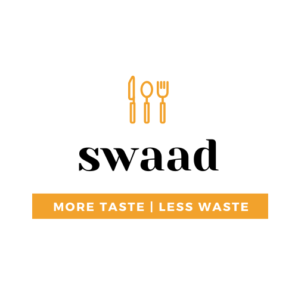

<h1 align="center">
   
  
</h1>

<h4 align="center">An AI based effort to reduce food wastage from households by incorporating the leftovers into delicious recipes!</h4>

__swaad__ (hindi for 'taste') follows our belief that leftover food just needs a little redsign and it can save a lot of food going to waste. __swaad__ is a simple-to-use, cost-effective application that requires you to take pictures of left-over items like fruits and groceries and it will use Computer Vision algorithms to identify them and suggest recipes that you can make from them!

  <a href="#motivation">Motivation</a> •
  <a href="#key-features">Key Features</a> •
  <a href="#powered-by">Powered By</a> •

## Motivation

The [UN's Sustainable Development Goals Action Campaign](https://sdgactioncampaign.org/) is a cooperative effort to develop a sustainable thinking and tangible approaches towards sustainability. In 2018, [The Chef's Manifesto](http://www.sdg2advocacyhub.org/chefmanifesto) was one of the winners of the UN SDG Action Campaign Award, to create a more holistic approach toward's sustainability, from the perspective of food. Since food production cannot be avoided, it is important to reduce it's wastage. But the question is, can we do something similar at home? 

> In the U.S., up to 40 percent of all food goes uneaten each year, at an annual cost of $218 billion!

## Key Features

:sparkles: Android app that is easy-to-use and understand

:sparkles: No special electrical/hardware requirements, just click pictures of food!

:sparkles: Segmentation and Recognition of more than 250 fruits and vegetables

:sparkles: Select multiple leftover ingredients at once

:sparkles: Smart recipe recognition - Recipes ordered on the basis of how many new ingredients do you wish to purchase!

## Powered By

<h5>
  
   
   
 </h5>
